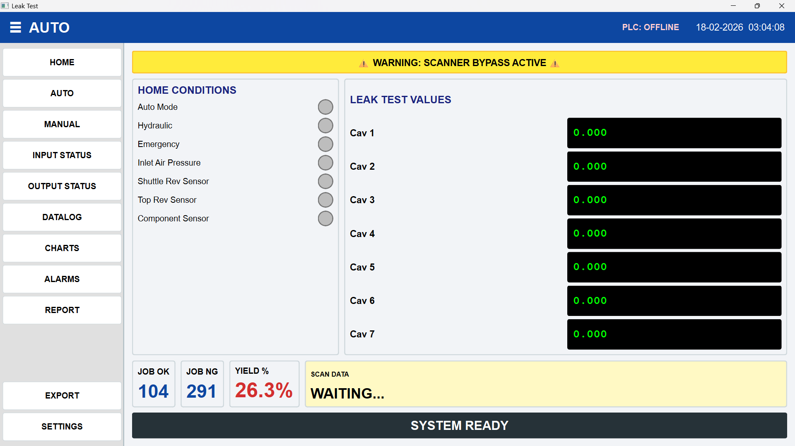
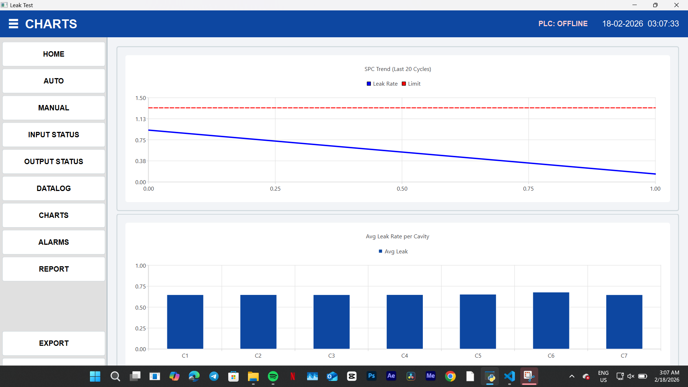
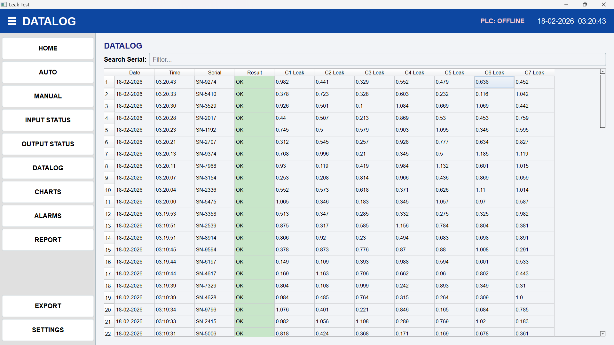

# INDUSTRIAL_HMI
A professional PC-based Industrial HMI built with Python (PySide6) for Leak Testing machines. Features real-time SPC charting, SQLite data logging, automated PDF &amp; CSV reporting, and PLC connectivity, replacing expensive proprietary hardware.
## 📸 Project Screenshots

### 1. Main Dashboard (Auto Mode)

### 2. Live SPC Charts

### 3. SQL Data Log

### 📄 Sample Reports
- [View PDF Report](ProductionReport_18-02-2026.pdf)
- [View Excel Sheet](ProductionReport_18-02-2026.xlsx)
